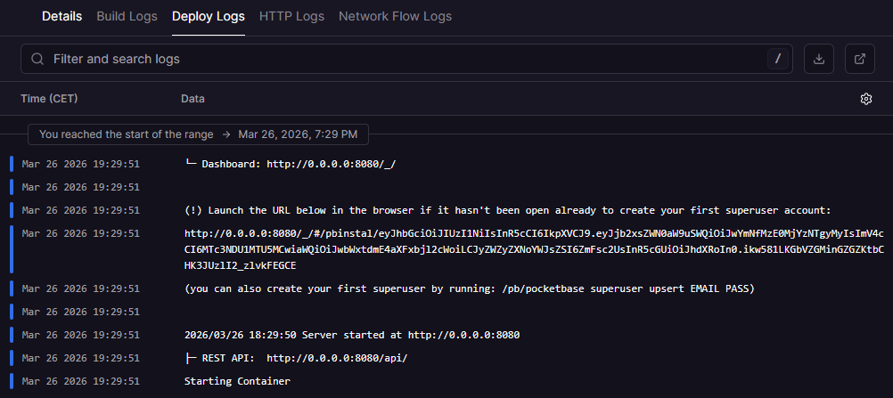

# PocketBase on Railway

PocketBase is an open-source backend in a single file—database, auth, file storage, and admin dashboard included.

## Environment Variables

| Variable | Description | Required |
|----------|-------------|----------|
| `PB_ENCRYPTION_KEY` | 32-character key to encrypt sensitive settings (e.g. SMTP passwords) | No |
| `GOMEMLIMIT` | Memory limit to prevent OOM crashes in MB (e.g. `512`, `1024`) | No |

---

## After deployment

1. **Access the admin panel:** Visit `https://your_domain_here.railway.app/_/` after deployment
2. **Create your superuser:** If you see a login screen instead of a setup page, check the **Deploy Logs** in Railway dashboard for a direct link to create your first admin user

